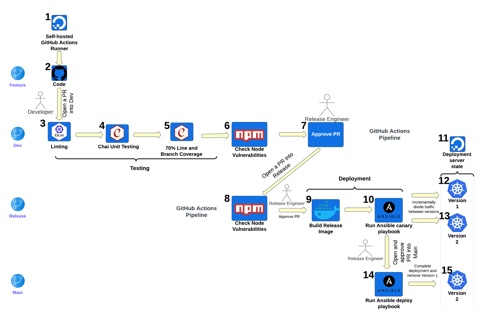

# CSC 519 Project

<div style="text-align: justify">

## Team Members: 
1. Luke Jenquin, lgjenqui
2. Sam Stone, sjstone3
3. Jubitta John, jjohn6

## Problem Statement

Our project is considered critical infrastructure for the business that is creating it because all online orders and inventory is managed through it. If there is an issue with the website, it could severely damage the reputation and revenue of the coffee shop. Because of these high stakes and the large workload, developers are spending a significant amount of time ensuring that deployment and product management is done correctly without sufficient time being allocated for new feature development. Our goal, therefore, is to reduce the complexity of developing and deploying this project, allowing the developers of the project to develop and release new features with less complexity and greater quality assurance. Our project will also include mitigations for events such as the rare bad release. This will allow the developers to easily and predictably mitigate potential issues before they impact the entire set of users. Without our project implementation, such a significant issue would impact the developers scrambling to correct the issue, the coffee shop desiring a good experience for their users, and the users who expect a pleasing experience with the company.

Our project will seek to resolve these problems through the creation of pipelines that the developers use. Every time a merge request is created, one of our proposed pipelines will perform automatic testing, calculate test coverage metrics and thresholds, conduct linting tests, and scan for vulnerable packages. This will ensure that every merge meets quality expectations and does not introduce functionality regressions. This quality and speed advantage will directly impact both the developers and company stakeholders because it will allow for a quicker, more thorough development cycle. If the developer is creating a release merge request, there will be additional manual steps to create a uniform development environment using Docker before deploying the container with Ansible. This will be manually triggered to avoid an unintentional deployment; however, most deployment steps themselves will remain completely automated to allow for a consistent, predictable deployment strategy. To assist with the deployment, our project will use Kubernetes to facilitate a canary release. This will allow the release manager to monitor and incrementally increase the load on the newly deployed version to ensure confidence in the new version. Simultaneously, the load on the pre-existing version will be reduced to allow for the new version to gain a sufficient testing user base. If there is any unacceptable behavior observed in the new version, the release engineer will be able to cancel the release until a new version is ready for deployment. This will be a critical component of our deployment strategy because it will ensure that there is no downtime as a new version is deployed while ensuring that any issues can be appropriately detected and addressed before reaching all users. "With this pipeline, our flawless deployments will yield more freshly brewed features and satisfied customers". 

## Use Case

PR to development branch triggers automated testing with linting, test suite, code coverage, and node package vulnerability analysis.

1) Preconditions

    &rarr; Deployment machine is provisioned and ready.

    &rarr; A self-hosted GitHub Actions system is set up.

    &rarr; A development branch exists.

2) Main flow

   &rarr; The developer will initiate the pipeline by opening a PR to the development branch [S1]. The system executes a series of automated steps starting with linting, running unit tests, a code coverage analysis, and a node package vulnerability analysis [S2]. After the tests and analysis are complete, the system provides the results [S3].

3) Subflows

    &rarr; [S1] User writes a PR message and requests the needed reviewers as well as the Release Engineer.

    &rarr; [S2] GitHub Actions creates a test environment to test code

    &rarr; [S3] If all of the tests and analysis are passing, the Release Engineer can approve the PR.
    
4) Alternative Flows

    &rarr; Compilation fails

    &rarr; Linting fails

    &rarr; Unit tests fail

    &rarr; The code does not have at least 70% line and branch coverage

    &rarr; The vulnerability analysis on installed node packages don’t pass

    ```
    Use Case: PR to release branch triggers automated deployment of test suite.

    1 Preconditions
        Deployment machine provisioned.
        Self-Hosted GitHub Actions system provisioned.
        A release branch exists.

    2 Main Flow
        Developer will initiate the pipeline by initiating a PR to the release branch[S1]. PR has to be approved by the Release Engineer (assumed to be another user).[S2]. Tests runs. [S3]. Tests return results [S4]

    3 Subflows
        [S1] User provides PR message and requests appropriate reviewers (including the Release Engineer).
        [S2] PR approved by Release Engineer.
        [S3] GitHub actions creates test environment and tests code.

    4 Alternative Flows
            [E1] Compilation fails.
            [E2] Test suite failes.
    ```

## Pipeline Design



### Pipeline architecture components

**a. Block 1 - Self hosted Github Action Runner**

All the GitHub Actions will be run on a self-hosted GitHub Actions runner. The GitHub Actions runner that will be used throughout the pipeline will be hosted on DigitalOcean. The Ubuntu version used for the runner is Ubuntu 22.04 LTS.

**b. Block 2 - Code**

In our development process, changes will be introduced on feature branches, where developers work on new features, bug fixes, or other updates. Once these changes are ready, developers will initiate a Pull Request (PR) to merge them into the Dev branch. All of the code will be hosted on GitHub.

**c. Block 3 - Linting**

A set of tests will be automatically initiated against a Pull Request targeting the Dev branch using a GitHub Actions pipeline. ESLint, an analysis tool used for identifying and fixing problems in JavaScript, will serve as the linter for the changes in the Pull Request. We will use the linter to ensure that any new code follows the same conventions and formatting as everything else in the Coffee Project. This standardization is important when developers need to share, reuse, and extend existing code.

**d. Block 4 - Chai Unit Testing**

The Coffee project includes unit tests written in JavaScript to verify the correctness of existing and new code changes. These unit tests will be triggered by a GitHub Action to ensure their success.

**e. Block 5 - 70% Line and Branch Coverage**

We propose to implement a stringent code coverage requirement, set at a minimum of 70% for both line and branch coverage for the initiated PR. This vital step ensures that our automated tests not only validate the correctness of our code changes but also guarantee comprehensive test coverage, significantly reducing the potential for undetected issues or regressions in our software. To support this initiative and effectively measure our code coverage, we plan to leverage Codecov(using Github Actions), a robust tool for collecting and visualizing coverage data.

**f.Block 6 - Check Node vulnerabilities**

Using npm audit we will check the installed package dependencies to report any vulnerabilities configured in the Coffee Project. This is important to manage in order to mitigate potential NPM malware attacks, which use NPM packages to spread malicious code, as well as other security risks. This step in the pipeline will fail if there are any high or critical vulnerabilities. While ideally there would be 0 vulnerabilities, sometimes it is difficult to achieve while using third party libraries.

**g. Block 7 - Approve PR (By release engineer)**
After all tests have successfully passed, the PR is subject to code reviews and approvals by the Release Engineer. Once it receives the necessary approvals, the PR will be automatically merged into the Dev branch. This integration effectively incorporates the changes into the primary development codebase, ensuring that new features and bug fixes undergo thorough review and validation before becoming part of the core development branch. Subsequently, a new PR will be initiated into the Release branch by the Release Engineer, marking the progression of these changes toward a future release.

**h. Block 8 - Check Node vulnerabilities**

When the Release Engineer opens a PR from the development branch to the feature branch, the node vulnerabilities are checked a second time. This is done because once all of the features have been merged together, new vulnerabilities could be introduced if developers have installed new packages that conflict with each other.

**i. Block 9 - Build Release Image**

Following the successful node vulnerability check and PR approval by the Release Engineer, the PR will be automatically merged into the Release branch. Subsequently, the deployment process will commence with the creation of the release image. To achieve this, we will copy a predefined Dockerfile into the repository, which will serve as a blueprint for how our application should be containerized. The Docker container will then be built and executed, with the assistance of a local Docker registry, ensuring that the release image is efficiently constructed and ready for deployment. This step plays a pivotal role in the seamless and reliable release of our software.

**j. Block 10 - Run Ansible canary playbook**
This step in the deployment will involve the creation of an Ansible playbook tailored for Canary deployments. It includes configuring parameters to control the Canary group's percentage and will trigger the playbook to start the Canary deployment.

**k. Block 11 - Deployment server state**

We will actively monitor the performance of the Canary group as the new version is rolled out on the DigitalOcean-hosted Kubernetes cluster. We will validate its stability, correctness, and performance by collecting various metrics and feedback. This step is important to ensuring that our deployment on the Digital Ocean infrastructure is performing as expected during the Canary phase.

**l. Block 12 - Version 1**

At this stage, most of our pods will continue to run the stable version of the application, representing the initial state of the Canary deployment. Initially 90% of the traffic will be directed to this version of our application.

**m. Block 13 - Version 2**

Here, we will introduce the new version of our application into the Canary group, gradually replacing Version 1 pods with Version 2 pods. The job of incrementally changing the traffic among pods will be done by the team’s Devops Engineer.

**n. Block 14 - Run Ansible deploy playbook**

After the Canary deployment has received enough feedback that the new version of our application is working successfully, the Release Engineer will open and approve a PR from the release branch into the main branch. From here, in the final phase of deployment, we will prepare an Ansible playbook to deploy the new version of our application.

**o. Block 15 - Version 2**	

This is the state where, if the Canary deployment is successful, all pods will run the new Version 2 of the application. It represents the final state of the Canary deployment process. At this stage, the old Version 1 will no longer be needed and we can remove it.

### Project Constraints and Guidelines

a. Branch Protection Rules
    
1. Dev Branch:

    1. Code reviews are mandatory before merging PRs into the Dev branch.
    2. Reject the PRs that don’t pass all the testing checks.
    3. Only Release Engineers have permission to approve any PRs into the dev branch.

2. Release Branch:

    1. Only Release Engineers have permission to approve PRs into the Release branch.
    2. Automatically create version tags for successful releases.

3. Main Branch:

    1. Only Release Engineers have permission to approve and merge PRs into the Main branch.

b. Runner for GitHub Actions

1. GitHub Actions will be self-hosted on a Digital Ocean server, running Ubuntu 22.04 LTS as the operating system on the runner.

c. Software Rollout Method
1. The roll-out method used is the Canary release, which is deployed on a Digital Ocean-hosted Kubernetes cluster.

d. Testing and Security Standards
1. Developers should adhere to coding standards, ensure unit tests pass, aim for at least 70% code coverage, and address security vulnerabilities in third-party packages.

</div>
